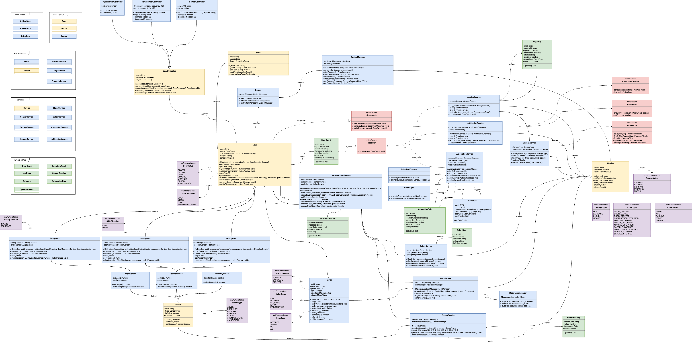

# 차고 개폐 시스템 설계

- [Notion](https://singun11.notion.site/kmu-sw-architecture-hw-1)

## UseCase Diagram


## Result (UML Diagram)



```
- Actor : User, Remote Controller, Actuator
- Garage System 내의 Use Case
  - Open the door
  - Close the door
  - Stop the door
```

## 요구사항

- 차고지 개폐 시스템에 필요한 interface, abstract class, class를 설계한다.
- 위의 Use Case를 기본적으로 만족해야 한다.

## 추가적인 상황 부여

```markdown
- Door 라는 Abstract 클래스를 통해 문의 종류를 다양하게 고려한다.
  - 옆으로 열릴 수도, 위로 열릴 수도, 앞뒤로 밀거나 당기면서 열릴 수도 있다.
  - 양옆으로 열리는 문일 수도 있다.
- 차고지에 문이 여러 개 있을 수 있다.
- 문을 닫거나 여는 과정 중에 중간에 사용자가 임의로 멈출 수도 있다.
- 사용자가 열린 문의 정도(%)를 알 수 있다.
- 장애물을 감지하면 개폐를 중단해야 하며, 이 또한 기록되고 알림이 가야 한다.
- 문의 작동에 대해 센서를 연결해서 감지해야할 수 있다.
- 문을 조작함에 있어서 여러 방식이 있을 수 있다.
  - 물리 버튼을 통해 연결될 수도 있다.
  - 리모트 컨트롤러(리모콘)으로 적외선 신호를 쏴서 연결될 수도 있다.
  - IoT 기반 서버를 통해 Wifi 신호를 받아 연결될 수도 있다.
  - 따라서, 문과 문을 조작하는 요소 Controller 사이에 확장가능한 요소가 있어야 한다.
- 일정 시간에 문을 열게 하는 등의 자동화 시스템을 고려할 수 있다.
- 문의 개폐 등을 기록하는 Logger와, 이를 저장하는 시스템이 있을 수 있다.
- 문의 개폐가 일어날 때 특정 이벤트를 사용자에게 알리는 Notification 시스템이 있을 수 있다.
```
